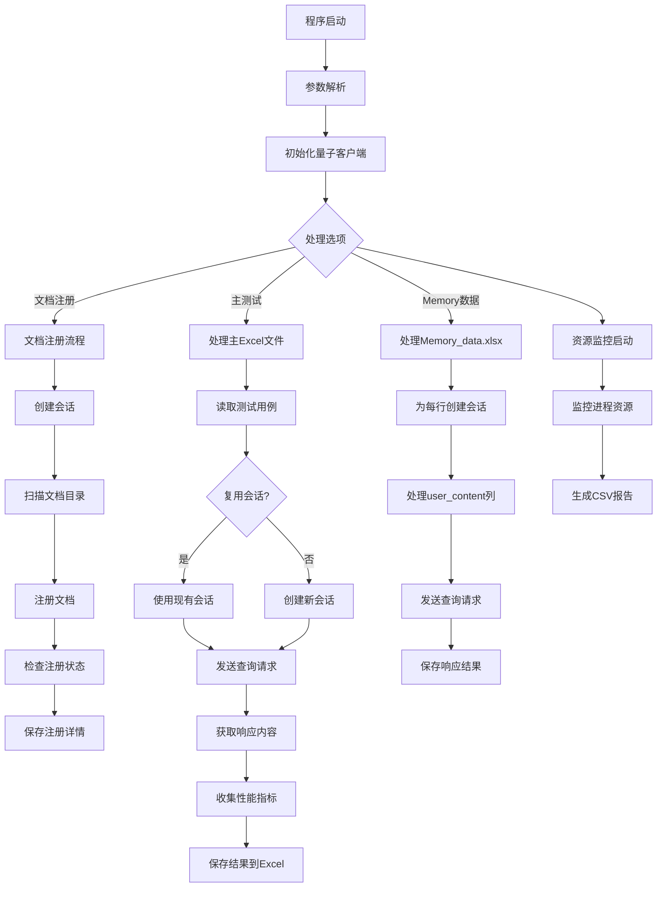

# 🚀 Quantum E2E 测试工具

这是一个用于测试量子 SDK 的端到端测试工具，支持文档注册、查询处理、内存数据处理等功能。

## 📋 功能特性

- ✅ **文档注册**: 自动扫描并注册指定目录下的文档
- ✅ **查询处理**: 支持文本和图像查询
- ✅ **内存数据处理**: 处理 Memory_data.xlsx 文件
- ✅ **资源监控**: 实时监控系统资源使用情况
- ✅ **性能指标收集**: 收集 TTFT、Token 数量、生成速度等关键性能指标
- ✅ **循环测试**: 支持多次循环执行测试用例
- ✅ **自动化判断**: 集成自动结果评估功能

## 🛠️ 环境要求

```bash
Python >= 3.8
pandas
openpyxl
argparse
ctypes
threading
queue
```

## 📁 目录结构

```
.
├── dataset/                 # 测试数据集
│   └── test.xlsx           # 主测试用例文件
├── Image/                  # 图像资源目录
├── files/                  # 文档注册目录
├── logs/                   # 日志文件目录
├── testresult/             # 测试结果输出目录
├── utils/
│   ├── monitor_util.py     # 资源监控工具
│   └── start_stop_services.py  # 服务控制工具
└── Quantum_e2e_20251215_nova_dll.py  # 主程序文件
```

## ⚙️ 参数说明

| 参数 | 类型 | 默认值 | 描述 |
|------|------|--------|------|
| `--dll_path` | string | `"C:\Users\obe\quantum-sdk-1.0.8.dll"` | 量子SDK DLL文件路径 |
| `--excel_dir` | string | `"dataset/test.xlsx"` | Excel文件目录路径 |
| `--image_dir` | string | `"Image/"` | 图像资源目录路径 |
| `--doc_dir` | string | `"files/all"` | 文档注册目录路径 |
| `--memory_excel` | string | `"test.xlsx"` | Memory注册Excel文件路径 |
| `--process_memory` | boolean | `True` | 是否处理Memory数据 |
| `--process_document` | boolean | `False` | 是否处理文档注册 |
| `--process_main` | boolean | `True` | 是否处理主Excel文件 |
| `--process_all` | boolean | `False` | 是否执行完整流程 |
| `--cycle` | int | `1` | 循环轮数 |
| `--gpu_type` | string | `"aGPU"` | GPU类型 (dGPU/iGPU/aGPU) |

## ▶️ 使用方法

### 基本使用

```bash
python Quantum_e2e_20251215_nova_dll.py
```

### 指定参数运行

```bash
# 完整流程测试
python Quantum_e2e_20251215_nova_dll.py --process_all --cycle 3

# 只处理文档注册
python Quantum_e2e_20251215_nova_dll.py --process_document

# 只处理主Excel文件，循环5次
python Quantum_e2e_20251215_nova_dll.py --process_main --cycle 5
```

## 📊 输出文件说明

### 测试结果文件

- `test_results_{filename}_cycle{N}.xlsx`: 主测试结果文件
  - Sheet 'result': 查询结果和性能指标
  - Sheet 'resource': 系统资源监控数据

### 文档注册相关

- `document_registration_{timestamp}.xlsx`: 文档注册详情
- `registered_docs.json`: 已注册文档列表缓存

### 内存数据处理

- `Memory_data_with_responses_{timestamp}.xlsx`: 内存数据处理结果

## 📈 性能指标收集

程序会自动收集以下性能指标：

- 🕐 **响应时间**: 从发送请求到接收完整响应的时间
- ⏱️ **TTFT (Time To First Token)**: 首字时间
- 🔤 **Token数量**: 生成的Token总数
- ⚡ **生成速度**: Tokens/秒
- 📅 **首文本响应时间**: 第一个文本响应的时间点

## 🔧 核心组件

### QuantumClientManager 🧠
负责与量子SDK通信的核心管理器：
- 管理客户端连接
- 处理异步回调
- 管理任务队列

### MultimodalAPI 💬
多模态API接口封装：
- 会话管理
- 文档注册
- 查询处理
- 结果获取

### 资源监控 📊
实时监控系统资源使用情况：
- CPU使用率
- 内存占用
- GPU使用情况(如果适用)

## 🔄 工作流程



## 📝 Excel文件格式

### 主测试文件格式

| 列名 | 必需 | 描述 |
|------|------|------|
| `question` | ✅ | 查询问题文本 |
| `pathlist` | ❌ | 图像文件名列表(逗号或分号分隔) |
| `new_session` | ❌ | 是否创建新会话(Y/N)，默认Y |

### Memory数据文件格式

| 列名 | 描述 |
|------|------|
| `user_content*` | 包含"user_content"的列都会被处理 |
| `pathlist` | 图像路径列表(可选) |

## 🐛 常见问题排查

### 连接问题
- 检查DLL文件路径是否正确
- 确认量子服务是否正常运行
- 查看日志文件中的错误信息

### 文档注册失败
- 检查文档路径是否正确
- 确认文档格式是否支持
- 查看`registered_docs.json`文件权限

### 查询无响应
- 检查网络连接状态
- 确认查询参数是否正确
- 查看是否超时(默认180秒)

## 📋 日志说明

日志文件位于 `logs/` 目录下：

- `Quantum_api_{timestamp}.log`: 主程序日志
- `resource_monitor_{timestamp}.log`: 资源监控日志
- `resource_{timestamp}.csv`: 资源使用数据

## 📈 性能优化建议

1. **批量处理**: 使用`--cycle`参数进行批量测试
2. **会话复用**: 在相同上下文的查询中复用会话
3. **资源监控**: 合理设置监控间隔避免影响性能
4. **缓存机制**: 利用已注册文档缓存减少重复注册

## 🤝 贡献指南

1. Fork项目
2. 创建功能分支
3. 提交更改
4. 发起Pull Request

📝 **提示**: 使用前请确保所有路径配置正确，并且量子SDK服务正在运行。